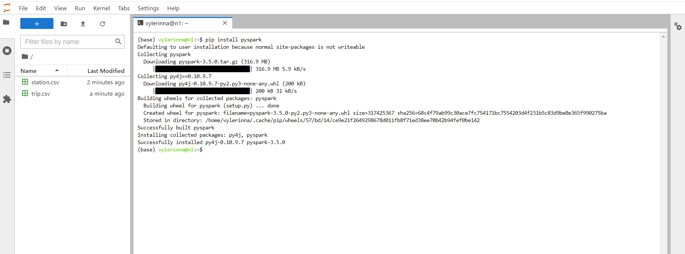
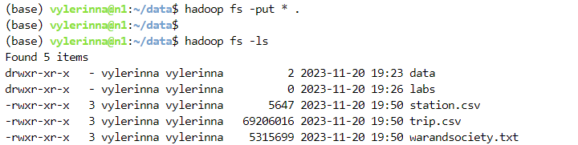

# Лабораторная работа 1. Введение в Apache Spark.
## Работа в консоли spark-shell/pyspark
### Основные операции взаимодействия с распределённой файловой системой MapR-FS
**Установка pyspark**

**Импорт/экспорт данных в РФС**

**Jupiter блокнот для данного раздела расположен по ссылке**
[L1_begin_spark_steps.ipynb](https://github.com/vellarLa/bigData2023/blob/main/Лабораторная%20работа%201/L1_begin_spark_steps.ipynb)

В ходе лабораторной работы также был проведен анализ данных велопарковок на языке Python в интерактивном режиме из Jupyter книг:

[L1_interactive_bike_analysis_python_with_rdd](https://github.com/vellarLa/bigData2023/blob/main/Лабораторная%20работа%201/L1_interactive_bike_analysis_python_with_rdd.ipynb)

[L1_interactive_bike_analysis_python_with_dataframes](https://github.com/vellarLa/bigData2023/blob/main/Лабораторная%20работа%201/L1_interactive_bike_analysis_python_with_dataframes.ipynb)

и проведите анализ данных велопарковок на языке Python в неинтерактивном режиме.

**Также были решены задачи для данных велопарковок Сан-Франциско (trips.csv, stations.csv):**

[L1_San Francisco.ipynb](https://github.com/vellarLa/bigData2023/blob/main/Лабораторная%20работа%201/L1_San%20Francisco.ipynb):
1. Найти велосипед с максимальным временем пробега.
2. Найти наибольшее геодезическое расстояние между станциями.
3. Найти путь велосипеда с максимальным временем пробега через станции.
4. Найти количество велосипедов в системе.
5. Найти пользователей потративших на поездки более 3 часов.
