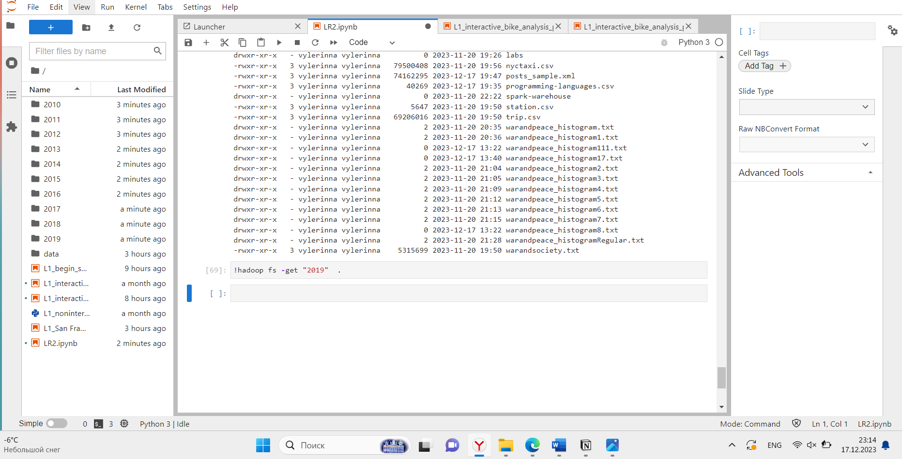
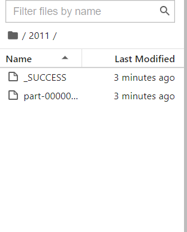

# Лабораторная 2. Формирование отчётов в Apache Spark
## Задание
Сформировать отчёт с информацией о 10 наиболее популярных языках программирования по итогам года за период с 2010 по 2020 годы. Отчёт будет отражать динамику изменения популярности языков программирования и представлять собой набор таблиц "топ-10" для каждого года.

Получившийся отчёт сохранить в формате Apache Parquet.

Для выполнения задания вы можете использовать любую комбинацию Spark API: RDD API, Dataset API, SQL API.

## Решение
Доступно по ссылке

[Лабораторная работа 2](https://github.com/vellarLa/bigData2023/blob/main/Лабораторная%20работа%202/LR2.ipynb)

**Результат формирования отчета:**

