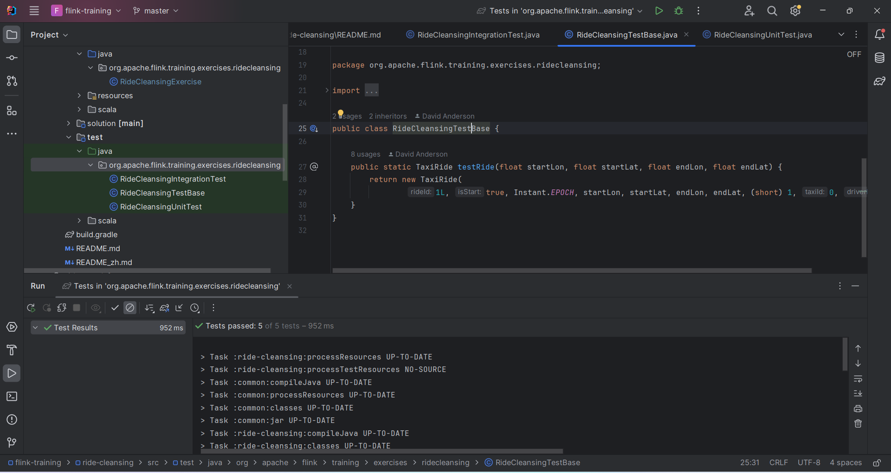
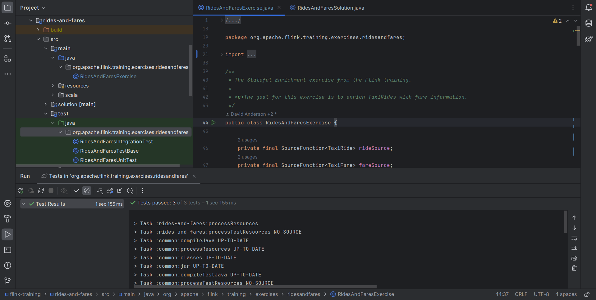
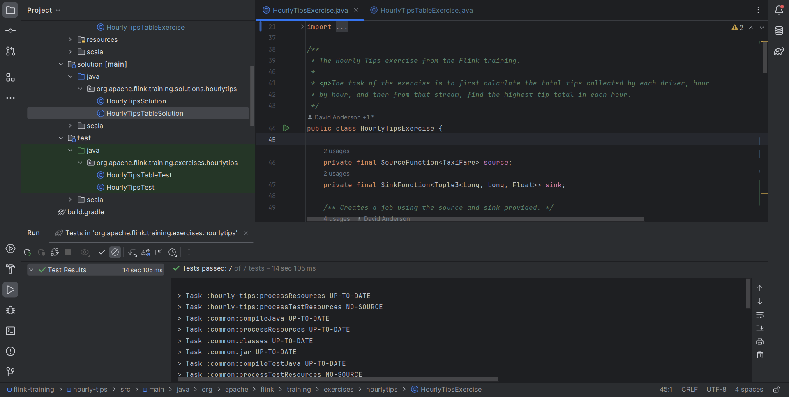
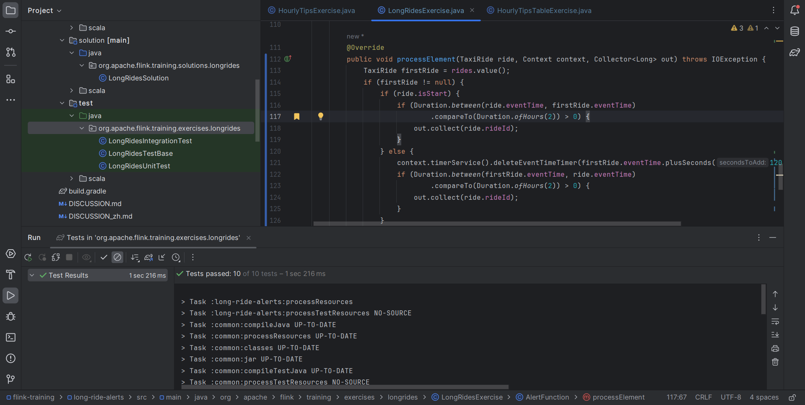

# Лабораторная 3. Потоковая обработка в Apache Flink
## Задание
Выполнить следующие задания из набора заданий репозитория https://github.com/ververica/flink-training-exercises:

1. RideCleanisingExercise
2. RidesAndFaresExercise
3. HourlyTipsExerxise
4. ExpiringStateExercise

## Решение
### RideCleanisingExercise

### RidesAndFaresExercise

### HourlyTipsExercise

### ExpiringStateExercise (LongRidesAlertsExcercise)

