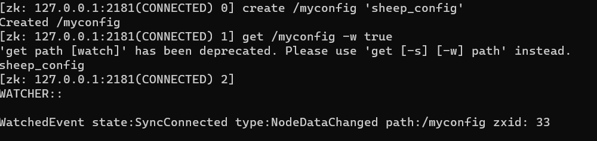
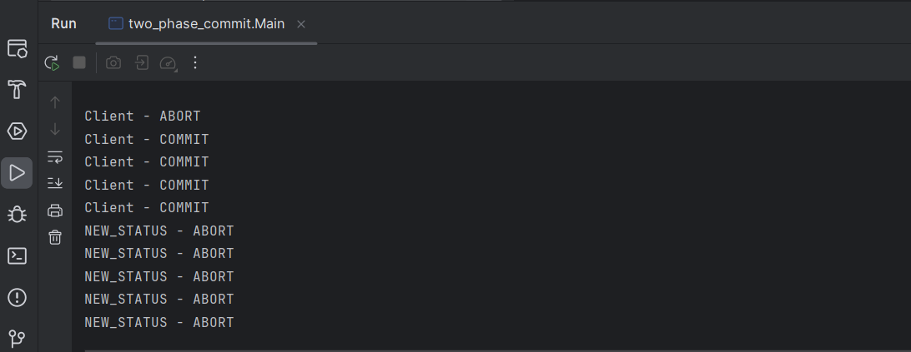

# Лабораторная работа 4. Zookeeper.
## Запуск сервера и клиента


## Изучение директории установки


## Создание и изменение узлов


## Работа с группами


## Watch-триггер


## Разработка приложения с барьерной синхронизацией, основанной на ZooKeeper


## Двуфазный коммит протокол

## Проблема обедающих философов

```Starting dinner...
Philosopher 5 wants to eat
Philosopher 1 wants to eat
Philosopher 4 wants to eat
Philosopher 3 wants to eat
Philosopher 2 wants to eat
Philosopher 4 is sitting
Philosopher 4 picked up the left fork
Philosopher 1 is sitting
Philosopher 4 picked up the right fork
Philosopher 1 picked up the left fork
Philosopher 4 started eating
Philosopher 1 picked up the right fork
Philosopher 1 started eating
Philosopher 1 finished eating
Philosopher 1 is thinking
Philosopher 5 is sitting
Philosopher 3 is sitting
Philosopher 3 picked up the left fork
Philosopher 2 is sitting
Philosopher 2 picked up the left fork
Philosopher 4 finished eating
Philosopher 5 picked up the left fork
Philosopher 3 picked up the right fork
Philosopher 4 is thinking
Philosopher 3 started eating
Philosopher 5 picked up the right fork
Philosopher 5 started eating
Philosopher 5 finished eating
Philosopher 5 is thinking
Philosopher 2 picked up the right fork
Philosopher 3 finished eating
Philosopher 2 started eating
Philosopher 3 is thinking
Philosopher 2 finished eating
Philosopher 2 is thinking```


